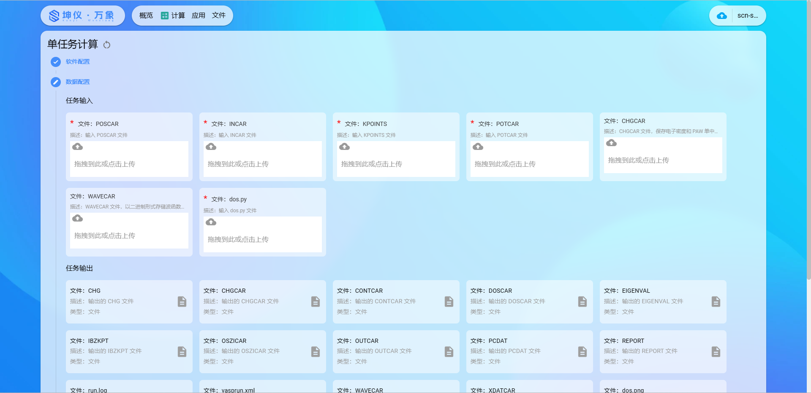

#### 1 keycloak用户注册
!!! note ""
    使用 ```keycloak``` 注册坤仪·万象 使用者门户账号，如果您已拥有```keycloak```的账号，可以跳过此步骤，登录坤仪·万象 提供者门户
#### 2 创建科学计算任务 
!!! note ""
    1. 使用keycloak用户账号登录，登录成功后，点击上方'计算'，进入计算服务界面
    
    2. 点击单任务计算，创建单任务作业
       
        a.选择计算软件，选择软件的版本及要使用的功能模块
        
        b.上传输入文件
        
        c.选择计算的队列
        
        d.提交计算作业
        


